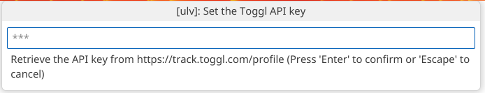

# ULV for Visual Studio Code

ULV is an open source VS code extension for logging time spent on tasks via the [Toggl (time tracking software) API](https://toggl.com/)

## Features

### Start a timer
1. Press `F1` or `CTRL + Shift + P` (or `⌘ + Shift + P` on macOS)
2. Type `ulv`
3. Select the option `ulv: Start time entry`
4. Specify a description of the task you're starting

### Stop the current timer
1. Press `F1` or `CTRL + Shift + P` (or `⌘ + Shift + P` on macOS)
2. Type `ulv`
3. Select the option `ulv: Stop time entry`
4. If a timer is running, it will be stopped

### See status
See the status bar on the bottom left-hand side of the VS Code window.
- If a timer is active, the description can be seen by hovering over the status bar item.
- To open Toggl.com in your browser, click the status bar item.
#### No active timer

#### Active timer

##### Hover

### Set the Toggl API key
The Toggl API key is stored in VS Code's secrets storage. If you wish to update/replace the current API key, you can do so by:
1. Press `F1` or `CTRL + Shift + P` (or `⌘ + Shift + P` on macOS)
2. Type `ulv`
3. Select the option `ulv: Set Toggl API key`

## Extension Settings
This extension contributes the following settings:

* `ulv.apiKey`: The API key for Toggl - stored in the VS code secrets storage.

## Disclaimer
This project is in no way affiliated with Toggl.
